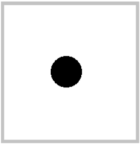
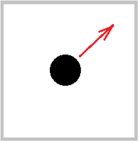
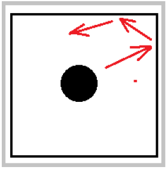
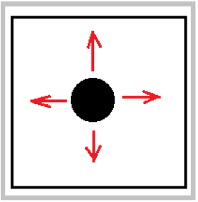
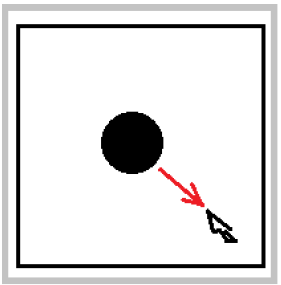
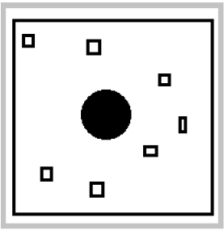
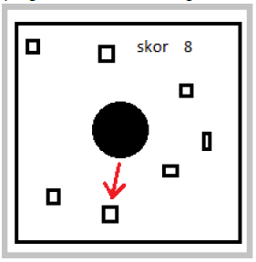

# DILo Problem Solving Challenge

This repository is for challenge in DILo Game Academy in Game Programmer Path.

## Challenges

### Challenge 1

Make circle in center

### Challenge 2

Make the circle can move with constant velocity until it's out of the screen

### Challenge 3

Make a box that is bigger than the circle and make the circle can bounce off the box

### Challenge 4

Make the circle move with the input (up, down, left and right)

### Challenge 5

Make the circle follow the cursor or touch's position with constant velocity

### Challenge 6

Spread the small boxes in the box randomly in both number and location

### Challenge 7

Make the circle can collide with the box. Save and show the number of boxes hat have been hit as a score. The box that has been hit is removed from the screen.

### Challenge 8

Respawn the box that has been hit after 3 seconds in random position. The location of the appearance mustn't be inside of the circle

### Challenge 9

Develop the result into a game.

### Challenge 10

Create one build containing a selection menu to access all builds.