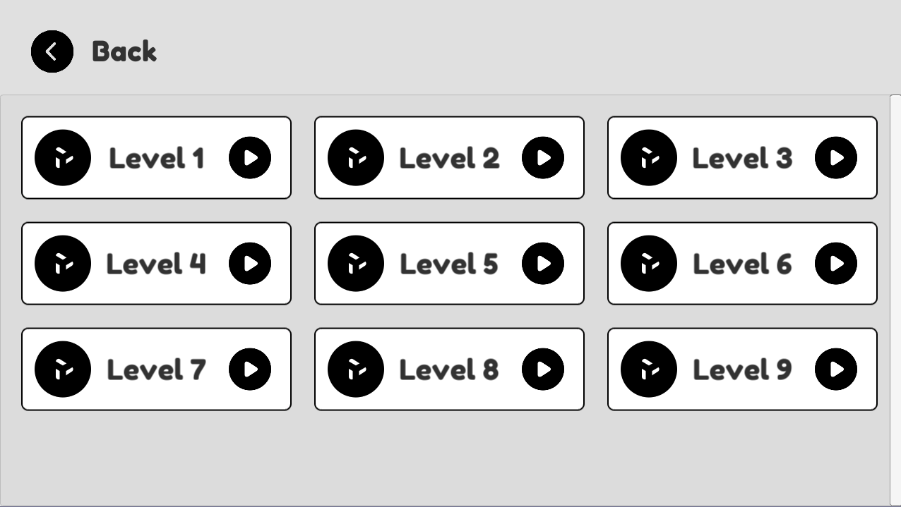

# DILo Problem Solving Challenge

This repository is for challenge in DILo Game Academy in Game Programmer Path.

Project Features
1. Singleton
1. Don't Destroy On Load
1. Audio
1. Grid Layout
1. Player Preferences
1. Score
1. Timer

## Getting Started
1. Clone this repository to your computer/laptop
1. Open it with Unity (Recommended Unity 2020.3.9f1)
1. Play with it.

## How to Install
1. Go to [Release tab](https://github.com/alfianAH/dilo-challange/releases)
2. Choose between Eat_eAt_eaT_x64.exe or Eat_eAt_eaT_x86.exe. Choose the one that suits your computer/laptop. **Make sure it is the latest version.**
3. It will automatically download the file to your computer.
4. After downloading, double click the .exe file, it will launch the game. (Because this is the portable version).
5. Done. You can play it now.

## Challenges

### Challenge 1

Make circle in center

### Challenge 2

Make the circle can move with constant velocity until it's out of the screen

### Challenge 3

Make a box that is bigger than the circle and make the circle can bounce off the box

### Challenge 4

Make the circle move with the input (up, down, left and right)

### Challenge 5

Make the circle follow the cursor or touch's position with constant velocity

### Challenge 6

Spread the small boxes in the box randomly in both number and location

### Challenge 7

Make the circle can collide with the box. Save and show the number of boxes hat have been hit as a score. The box that has been hit is removed from the screen.

### Challenge 8

Respawn the box that has been hit after 3 seconds in random position. The location of the appearance mustn't be inside of the circle

### Challenge 9

Develop the result into a game.

### Challenge 10

Create one build containing a selection menu to access all builds.

## Example Scene

